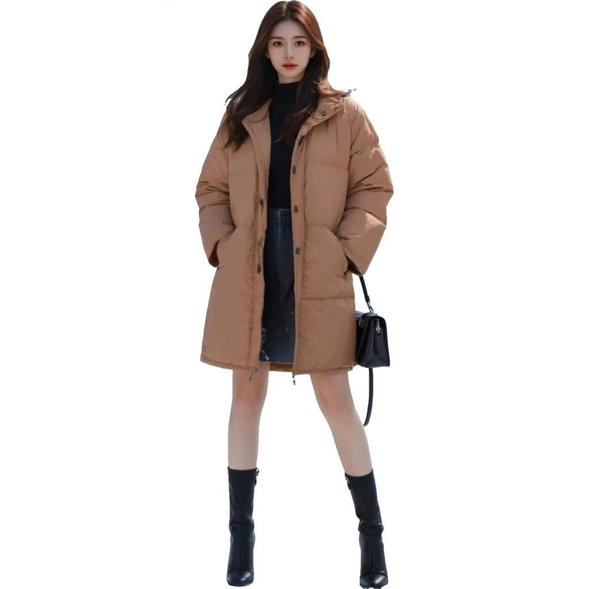
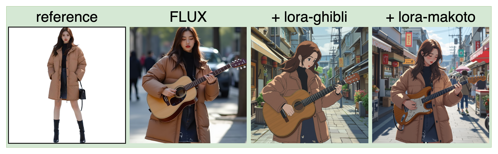
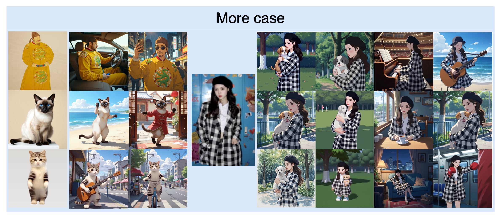
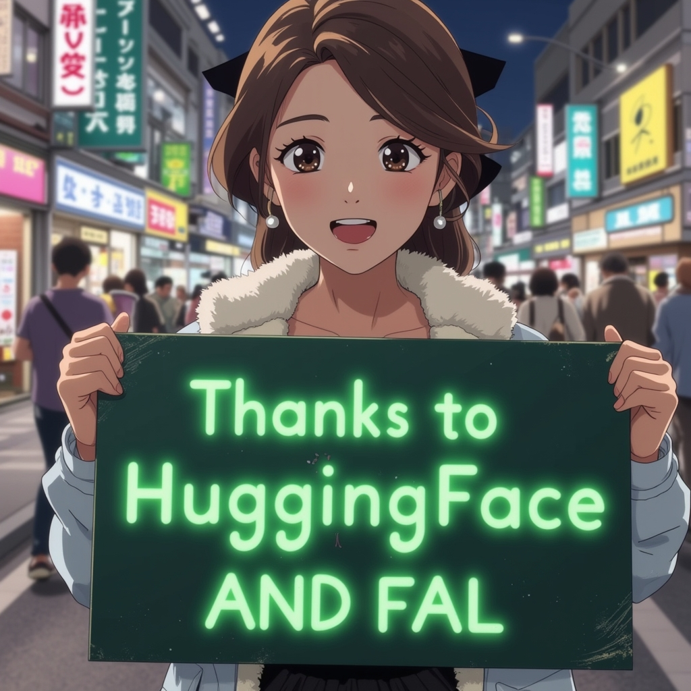
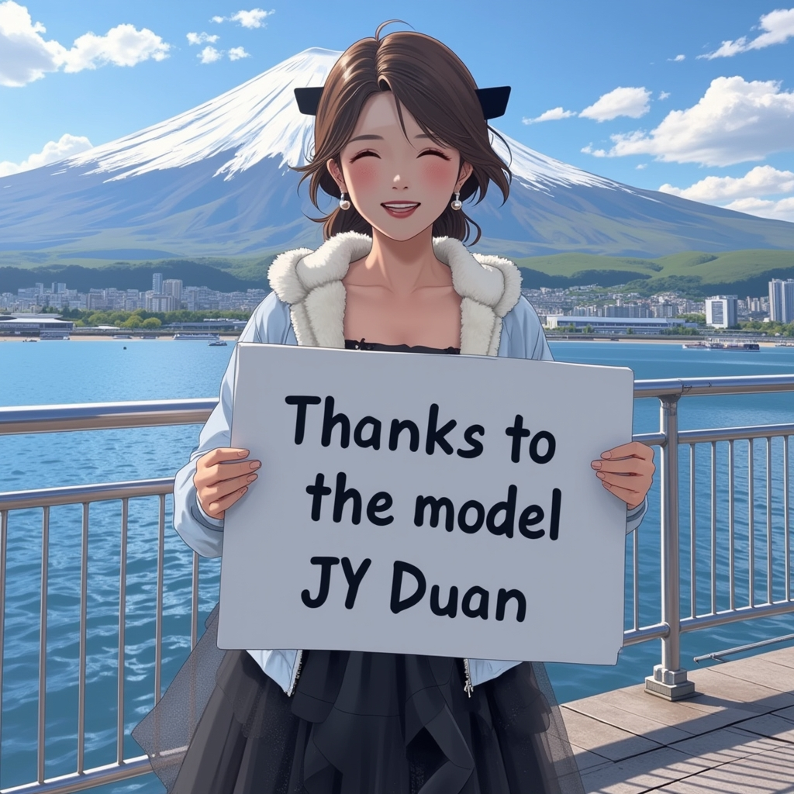

<div align="center">
<h1>InstantCharacter: Personalize Any Characters with a Scalable Diffusion Transformer Framework
 </h1>


[**Jiale Tao**](https://github.com/JialeTao)<sup>1</sup> · 
[**Yanbing Zhang**](https://github.com/Monalissaa)<sup>1</sup> · 
[**Qixun Wang**](https://github.com/wangqixun)<sup>12✝</sup> · 
[**Yiji Cheng**](https://www.linkedin.com/in/yiji-cheng-a8b922213/)<sup>1</sup> · 
[**Haofan Wang**](https://haofanwang.github.io/)<sup>2</sup> · 
[**Xu Bai**](https://huggingface.co/baymin0220)<sup>2</sup> · 
Zhengguang Zhou <sup>12</sup> · 
[**Ruihuang Li**](https://scholar.google.com/citations?user=8CfyOtQAAAAJ&hl=zh-CN) <sup>1</sup> · 
[**Linqing Wang**](https://scholar.google.com/citations?user=Hy12lcEAAAAJ&hl=en) <sup>12</sup> · Chunyu Wang <sup>1</sup> · 
Qin Lin <sup>1</sup> · 
Qinglin Lu <sup>1*</sup>


<sup>1</sup>Hunyuan, Tencent · <sup>2</sup>InstantX Team

<sup>✝</sup>tech lead · <sup>*</sup>corresponding authors

<a href='https://instantcharacter.github.io/'></a>
<a href='https://xxxxx'></a>
<a href='https://huggingface.co/spaces/InstantX/InstantCharacter'></a>
<!-- [](https://github.com/Tencent/InstantCharacter) -->


</div>


InstantCharacter is an innovative, tuning-free method designed to achieve character-preserving generation from a single image, supporting a variety of downstream tasks.


<!-- | reference | flux | + lora-ghibli | + lora-makoto |
|:-----:|:-----:|:-----:|:-----:|
|||| -->


## Release
- [2025/04/18] 🔥 We release the [demo](https://huggingface.co/spaces/InstantX/InstantCharacter) [checkpoints](https://huggingface.co/InstantX/InstantCharacter/) and [code](https://github.com/Tencent/InstantCharacter).
<!-- - [2025/04/02] 🔥 We release the [technical report](https://xxxxxxx/). -->
- [2025/04/02] 🔥 We launch the [project page](https://instantcharacter.github.io/).


## Download

You can directly download the model from [Huggingface](https://huggingface.co/InstantX/InstantCharacter).
```shell
huggingface-cli download --resume-download Tencent/InstantCharacter --local-dir checkpoints --local-dir-use-symlinks False
```

If you cannot access to Huggingface, you can use [hf-mirror](https://hf-mirror.com/) to download models.
```shell
export HF_ENDPOINT=https://hf-mirror.com
huggingface-cli download --resume-download Tencent/InstantCharacter --local-dir checkpoints --local-dir-use-symlinks False
```

Once you have prepared all models, the folder tree should be like:

```
  .
  ├── assets
  ├── checkpoints
  ├── models
  ├── infer_demo.py
  ├── pipeline.py
  └── README.md
```


## Usage


```python
# !pip install transformers accelerate diffusers huggingface_cli
import torch
from PIL import Image
from pipeline import InstantCharacterFluxPipeline

# Step 1 Load base model and adapter
ip_adapter_path = 'checkpoints/instantcharacter_ip-adapter.bin'
base_model = 'black-forest-labs/FLUX.1-dev'
image_encoder_path = 'google/siglip-so400m-patch14-384'
image_encoder_2_path = 'facebook/dinov2-giant'
seed = 123456
pipe = InstantCharacterFluxPipeline.from_pretrained(base_model, torch_dtype=torch.bfloat16)
pipe.to("cuda")
pipe.init_adapter(
    image_encoder_path=image_encoder_path, 
    image_encoder_2_path=image_encoder_2_path, 
    subject_ipadapter_cfg=dict(subject_ip_adapter_path=ip_adapter_path, nb_token=1024), 
)

# Step 2 Load reference image
ref_image_path = 'assets/girl.jpg'  # white background
ref_image = Image.open(ref_image_path).convert('RGB')

# Step 3 Inference without style
prompt = "A girl is playing a guitar in street"
image = pipe(
    prompt=prompt, 
    num_inference_steps=28,
    guidance_scale=3.5,
    subject_image=ref_image,
    subject_scale=0.9,
    generator=torch.manual_seed(seed),
).images[0]
image.save("flux_instantcharacter.png")
```


You can use style lora


```shell
# download style lora
huggingface-cli download --resume-download InstantX/FLUX.1-dev-LoRA-Ghibli  --local-dir checkpoints/style_lora/ --local-dir-use-symlinks False
huggingface-cli download --resume-download InstantX/FLUX.1-dev-LoRA-Makoto-Shinkai  --local-dir checkpoints/style_lora/ --local-dir-use-symlinks False
```

```python
# You can also use other style lora

# Step 3 Inference with style
lora_file_path = 'checkpoints/style_lora/ghibli_style.safetensors'
trigger = 'ghibli style'
prompt = "A girl is playing a guitar in street"
image = pipe.with_style_lora(
    lora_file_path=lora_file_path,
    trigger=trigger,
    prompt=prompt, 
    num_inference_steps=28,
    guidance_scale=3.5,
    subject_image=ref_image,
    subject_scale=0.9,
    generator=torch.manual_seed(seed),
).images[0]
image.save("flux_instantcharacter_style_ghibli.png")


# Step 3 Inference with style
lora_file_path = 'checkpoints/style_lora/Makoto_Shinkai_style.safetensors'
trigger = 'Makoto Shinkai style'
prompt = "A girl is playing a guitar in street"
image = pipe.with_style_lora(
    lora_file_path=lora_file_path,
    trigger=trigger,
    prompt=prompt, 
    num_inference_steps=28,
    guidance_scale=3.5,
    subject_image=ref_image,
    subject_scale=0.9,
    generator=torch.manual_seed(seed),
).images[0]
image.save("flux_instantcharacter_style_Makoto.png")
```

## More case
Animal character are relatively unstable.



<!-- ## Star History -->

<!-- [](https://star-history.com/#instantX-research/InstantCharacter&Date) -->


## Acknowledgment
 - Our work is sponsored by [HuggingFace](https://huggingface.co) and [fal.ai](https://fal.ai).

<div align="center">
  
</div>

 - Thanks to the model JY Duan.

<div align="center">
  
</div>


